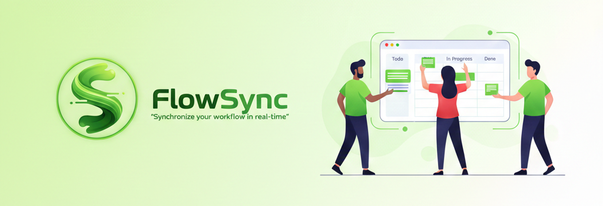
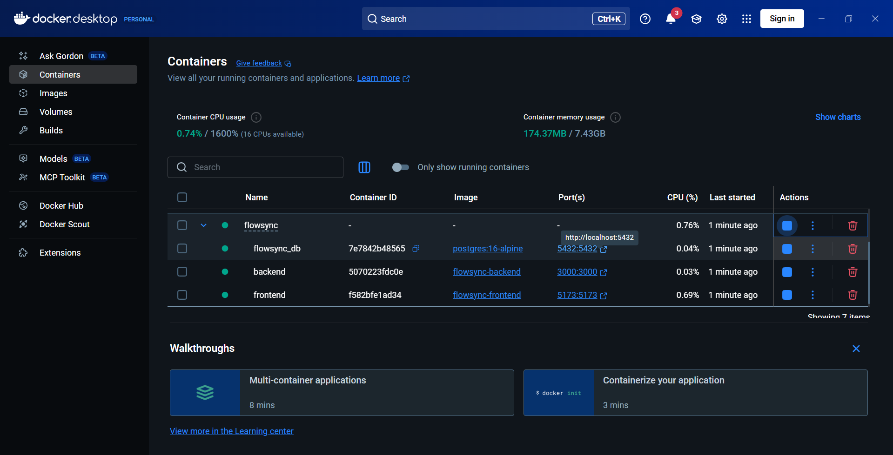
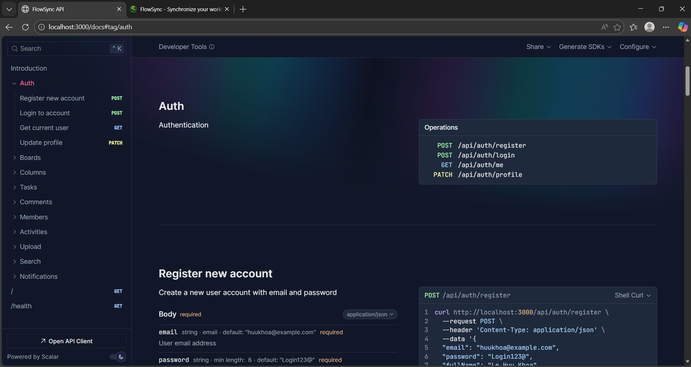
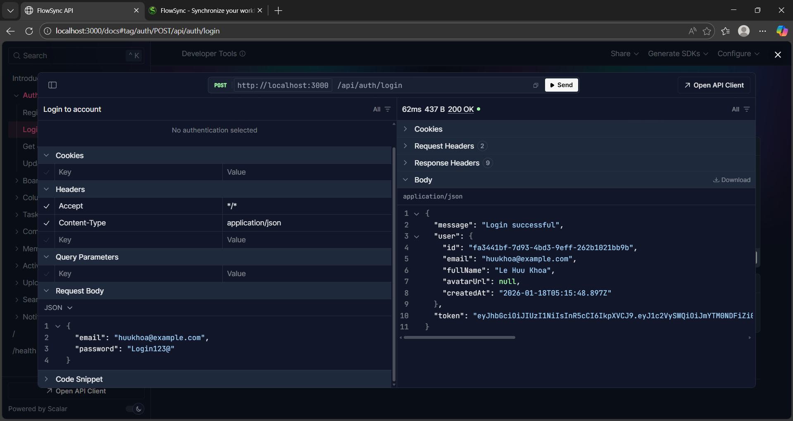
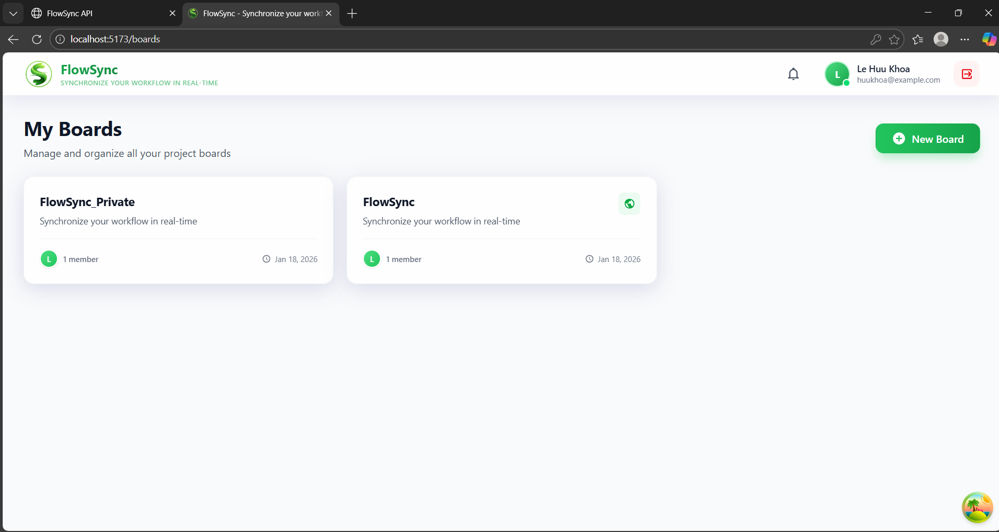
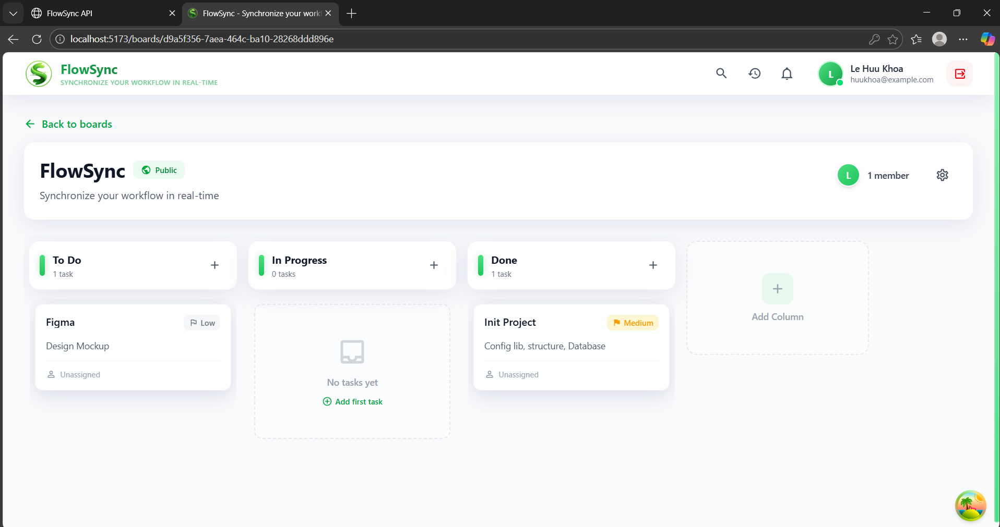
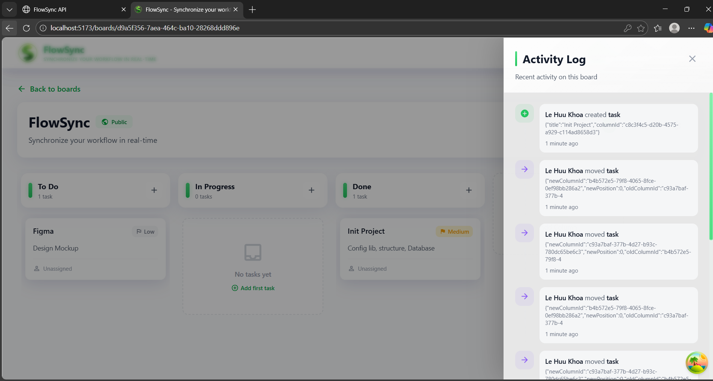
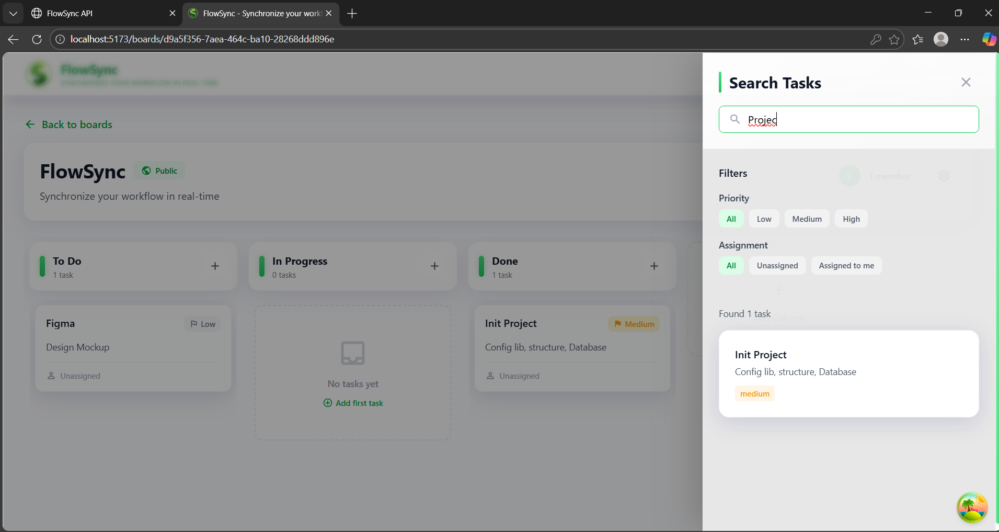

<p align="center">
  
</p>

# 📋 FlowSync

Synchronize your workflow in real-time

## 🎯 Overview

**FlowSync** is a modern, real-time collaborative task management application inspired by Trello. Built with cutting-edge technologies like Bun, Elysia, PostgreSQL, and React, it enables teams to organize projects, track progress, and collaborate seamlessly. With drag-and-drop functionality, real-time updates via WebSocket, and comprehensive activity tracking, teams can stay perfectly synchronized and boost productivity.

---

## 🎬 Application Screenshots

<div align="center">

>  **Click on each section below to view screenshots**

</div>

<details>
<summary>🐳 <b>Docker Deployment & Infrastructure</b></summary>
<br/>
<div align="center">

<p><i>Complete Docker setup with PostgreSQL, Backend, and Frontend services</i></p>
</div>
</details>

<details>
<summary>📚 <b>API Documentation (Swagger UI)</b></summary>
<br/>
<div align="center">

<p><i>Interactive API documentation powered by Elysia and Swagger</i></p>
</div>
</details>

<details>
<summary>🧪 <b>API Testing Interface</b></summary>
<br/>
<div align="center">

<p><i>Test API endpoints directly from the browser</i></p>
</div>
</details>

<details>
<summary>📊 <b>Boards Dashboard</b></summary>
<br/>
<div align="center">

<p><i>Manage multiple project boards with ease</i></p>
</div>
</details>

<details>
<summary>🎯 <b>Kanban Board View</b></summary>
<br/>
<div align="center">

<p><i>Drag-and-drop interface with real-time collaboration</i></p>
</div>
</details>

<details>
<summary>📝 <b>Activity Log & Audit Trail</b></summary>
<br/>
<div align="center">

<p><i>Complete history of all board activities and changes</i></p>
</div>
</details>

<details>
<summary>🔍 <b>Advanced Search & Filters</b></summary>
<br/>
<div align="center">

<p><i>Powerful search with priority, assignee, and column filters</i></p>
</div>
</details>

---

## 📚 Documentation

- **API Documentation**: Swagger UI at `http://localhost:3000/docs` when server is running
- **Database Schema**: [View Database Diagram](#) - Complete schema design with relationships
- **Setup & Support Guide**: [SUPPORT.md](./SUPPORT.md) - Detailed installation and troubleshooting guide

## 📂 Project Structure

```
📁 flowSync/
│
├── 📄 docker-compose.yml          # Docker orchestration for all services
├── 📄 .dockerignore               # Docker ignore patterns
├── 📄 README.md                   # This file
├── 📄 SUPPORT.md                  # Setup and support guide
│
├── 📁 backend/                    # Server-side application
│   ├── 📁 drizzle/                # Database migrations
│   ├── 📁 uploads/                # Uploaded files (avatars)
│   │   └── 📁 avatars/            # User avatar images
│   │
│   ├── 📁 src/                    # Source code
│   │   ├── 📁 config/             # Configuration files
│   │   ├── 📁 controllers/        # Request handlers
│   │   ├── 📁 db/                 # Database schema & connection
│   │   ├── 📁 lib/                # Utility libraries
│   │   ├── 📁 middleware/         # Custom middlewares
│   │   ├── 📁 routes/             # API route definitions
│   │   ├── 📁 services/           # Business logic services
│   │   ├── 📁 types/              # TypeScript type definitions
│   │   ├── 📄 websocket.ts        # WebSocket server
│   │   └── 📄 index.ts            # Server entry point
│   │
│   ├── 📄 Dockerfile              # Backend container config
│   ├── 📄 .dockerignore           # Backend Docker ignore
│   ├── 📄 .env                    # Environment variables (not in Git)
│   ├── 📄 .env.example            # Environment template
│   ├── 📄 .gitignore              # Git ignore rules
│   ├── 📄 package.json            # Dependencies & scripts
│   ├── 📄 bun.lockb               # Bun lock file
│   ├── 📄 drizzle.config.ts       # Drizzle ORM config
│   ├── 📄 tsconfig.json           # TypeScript config
│   └── 📄 README.md               # Backend documentation
│
└── 📁 frontend/                   # Client-side application
    ├── 📁 public/                 # Static assets
    ├── 📁 src/                    # Source code
    │   ├── 📁 api/                # API service layer
    │   ├── 📁 components/         # Reusable UI components
    │   │   ├── 📁 auth/           # Authentication components
    │   │   ├── 📁 kanban/         # Kanban board components
    │   │   ├── 📁 layout/         # Layout components
    │   │   └── 📁 modals/         # Modal components
    │   ├── 📁 hooks/              # Custom React hooks
    │   ├── 📁 layouts/            # Page layout wrappers
    │   ├── 📁 lib/                # Core utilities & configs
    │   ├── 📁 pages/              # Page components
    │   ├── 📁 store/              # Zustand stores
    │   ├── 📁 types/              # TypeScript type definitions
    │   ├── 📄 App.tsx             # Root component
    │   ├── 📄 main.tsx            # Entry point
    │   └── 📄 index.css           # Global styles
    │
    ├── 📄 Dockerfile              # Frontend container config
    ├── 📄 .dockerignore           # Frontend Docker ignore
    ├── 📄 .env                    # Environment variables (not in Git)
    ├── 📄 .env.example            # Environment template
    ├── 📄 .gitignore              # Git ignore rules
    ├── 📄 package.json            # Dependencies & scripts
    ├── 📄 bun.lockb               # Bun lock file
    ├── 📄 index.html              # HTML entry point
    ├── 📄 vite.config.ts          # Vite configuration
    ├── 📄 tailwind.config.js      # Tailwind CSS config
    ├── 📄 postcss.config.js       # PostCSS config
    ├── 📄 tsconfig.json           # TypeScript config
    └── 📄 README.md               # Frontend documentation
```

## ✨ Features

- 🎯 **Kanban Board Management** - Create, organize, and manage multiple boards
- 📋 **Drag & Drop Tasks** - Intuitive drag-and-drop interface for task management
- ⚡ **Real-time Collaboration** - Live updates via WebSocket for seamless teamwork
- 👥 **Team Management** - Invite members with role-based permissions (Owner/Editor/Viewer)
- 💬 **Comments & Mentions** - Collaborate with @mentions and threaded comments
- 🔔 **Smart Notifications** - Stay informed about task assignments and updates
- 🔍 **Advanced Search** - Full-text search with multiple filters (priority, assignee, column)
- 📊 **Activity Logging** - Complete audit trail of all board activities
- 🎨 **Priority Labels** - Organize tasks with Low/Medium/High priority badges
- 📱 **Responsive Design** - Works seamlessly on desktop, tablet, and mobile
- 🔐 **Secure Authentication** - JWT-based authentication with bcrypt password hashing
- 🖼️ **Avatar Upload** - Custom profile pictures with file validation

## 🚀 Quick Start

### Option 1: Docker (Recommended)

```bash
# 1. Clone repository
git clone https://github.com/Aohkne/FlowSync.git
cd flowSync

# 2. Create environment files
cp backend/.env.example backend/.env
cp frontend/.env.example frontend/.env

# 3. Start all services with Docker
docker-compose up -d

# 4. Access applications
# Frontend: http://localhost:5173
# Backend API: http://localhost:3000
# Swagger Docs: http://localhost:3000/swagger
# PostgreSQL: localhost:5432
```

### Option 2: Manual Setup

See [SUPPORT.md](./SUPPORT.md) for detailed manual installation instructions.

## 🛠️ Technology Stack

### Backend

| Technology  | Description                    |
| ----------- | ------------------------------ |
| **Bun**     | Ultra-fast JavaScript runtime  |
| **Elysia**  | High-performance web framework |
| **PostgreSQL** | Relational database         |
| **Drizzle ORM** | Type-safe ORM              |
| **JWT**     | Token-based authentication     |
| **WebSocket** | Real-time communication      |
| **Swagger** | API documentation              |

### Frontend

| Technology       | Description                     |
| ---------------- | ------------------------------- |
| **React 18**     | UI library                      |
| **TypeScript**   | Type-safe JavaScript            |
| **Vite**         | Lightning-fast build tool       |
| **Zustand**      | Lightweight state management    |
| **TanStack Query** | Server state synchronization  |
| **Tailwind CSS** | Utility-first CSS framework     |
| **DnD Kit**      | Modern drag & drop toolkit      |
| **React Hook Form** | Performant form validation   |
| **Zod**          | Schema validation               |

### DevOps

| Technology        | Description              |
| ----------------- | ------------------------ |
| **Docker**        | Containerization         |
| **Docker Compose** | Multi-container orchestration |
| **Bun**           | Package manager          |

## 📖 Documentation

- **Backend API**: See [backend/README.md](./backend/README.md)
- **Frontend**: See [frontend/README.md](./frontend/README.md)
- **Docker Setup**: See [README-DOCKER.md](./README-DOCKER.md)
- **Support Guide**: See [SUPPORT.md](./SUPPORT.md)

## 🎯 Use Cases

- **Project Management** - Organize team projects and sprints
- **Personal Task Tracking** - Manage your daily tasks and goals
- **Team Collaboration** - Work together in real-time
- **Agile Workflows** - Kanban-style boards for agile teams
- **Event Planning** - Coordinate tasks and timelines

## 🤝 Contributing

We welcome contributions! Please follow these steps:

1. Fork the repository
2. Create feature branch (`git checkout -b feature/amazing-feature`)
3. Commit changes (`git commit -m 'Add amazing feature'`)
4. Push to branch (`git push origin feature/amazing-feature`)
5. Open Pull Request

## 📄 License

This project is licensed under the MIT License - see the [LICENSE](LICENSE) file for details.

## 👥 Team

- **Full Stack Developer** - Your Name - [GitHub](https://github.com/yourusername)

## 📞 Contact

- **Email**: your.email@example.com
- **GitHub**: https://github.com/Aohkne/FlowSync
- **Issues**: https://github.com/Aohkne/FlowSync/issues
- **Support**: See [SUPPORT.md](./SUPPORT.md)

## 🙏 Acknowledgments

- [Elysia](https://elysiajs.com/) - Amazing web framework
- [Drizzle ORM](https://orm.drizzle.team/) - Type-safe ORM
- [Bun](https://bun.sh/) - Lightning-fast runtime
- [Zustand](https://github.com/pmndrs/zustand) - State management
- [TanStack Query](https://tanstack.com/query) - Server state management
- [DnD Kit](https://dndkit.com/) - Drag and drop toolkit

---

<div align="center">

### 🌟 Star Us on GitHub!

If you find this project useful, please consider giving it a star ⭐ on GitHub to help others discover it.

[](https://github.com/Aohkne/FlowSync)
[](https://github.com/Aohkne/FlowSync/fork)
[](https://github.com/Aohkne/FlowSync)

</div>